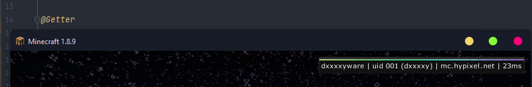

# Icarus
> rebranded from MineSenseUI

A very simple and [lightweight](#lightweightness) GUI and Config library for Minecraft Forge 1.8.9 modding heavily inspired by the GameSense/Skeet CS:GO cheat (not an exact copy). A fully working example mod using this library can be found at [test](src/main/java/studio/dreamys/test).

## Setup
### Gradle
```
repositories {
    maven { url "https://repo.dreamys.studio/" }
}
```
```
dependencies {
    implementation "studio.dreamys:Icarus:$VERSION"
}
```

Replace `$VERSION` with the latest from the [repo](https://github.com/DxxxxY/repo/tree/master/studio/dreamys/Icarus).

## What's new in v2
- **.json**
- **Same look (skeet)**
- **Customizability (font, components)**
- **~90% code rewrite**
- **New and redesigned config system (reflection)**
- **Complete separation of UI and Config**
- **Enhanced and simplified developer experience**

## [Wiki](https://github.com/DxxxxY/Icarus/wiki/)

## UI Components
- Button
- Checkbox
- Choice
- ~~Color~~ (coming soon)
- Combo
- Field
- Slider
- Keybind
- Group
- Page
- Window

## Extra
- [Notification](https://www.youtube.com/watch?v=624J5kAZqNw&ab_channel=DxxxxY)
- Watermark 

## Lightweightness
- Everything is rendered using libraries present on runtime.
- Other than importing this library, nothing is needed.
- Everything is created and stored on client preInit.
- Reflected data is cached and accessed quicker.
- Only dependent on the Reflections library.

## Menu (as of 09/02/2022) is fully functional:
