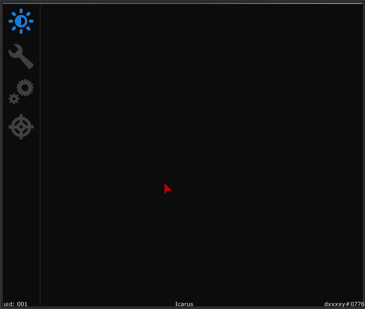

# Icarus
> rebranded from MineSenseUI

A simple and extremely [lightweight](#lightweightness) Gui and config library for Minecraft Forge 1.8.9 modding heavily inspired by the GameSense/Skeet CS:GO cheat (not an exact copy). A fully working example mod using this library can be found at [test](src/main/java/studio/dreamys/test).

## Importing
### Gradle
```
repositories {
    maven { url "https://repo.dreamys.studio/" }
}
```
```
dependencies {
    implementation "studio.dreamys:Icarus:1.1.3"
}
```

## Components
> Some components have secondary constructors with default values.
- Button
- Checkbox
- Choice
- ~~Color~~ (coming soon)
- Combo
- Field
- Group
- Keybind
- Slider
- Page
- Window

## Lightweightness
- Everything is created and stored on client init.
- Everything is rendered using libraries present on runtime.
- Small size, no extra-dependencies, no bloatware.

## Menu (as of 09/02/2022) is fully functional:
