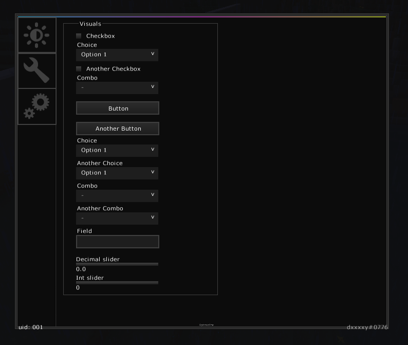

# Icarus
> renamed from MineSenseUI

A GUI menu inspired by some CS:GO cheats, notably: GameSense/Skeet (but not an exact copy)

~~Very~~ Early development.

## Menu (as of now) is a single window with a single Page:
